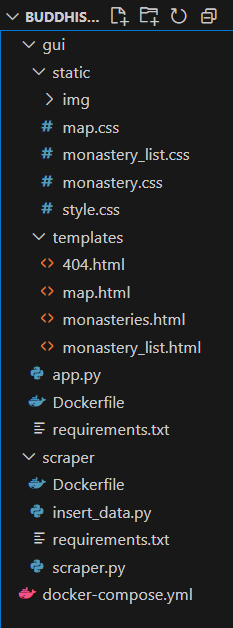
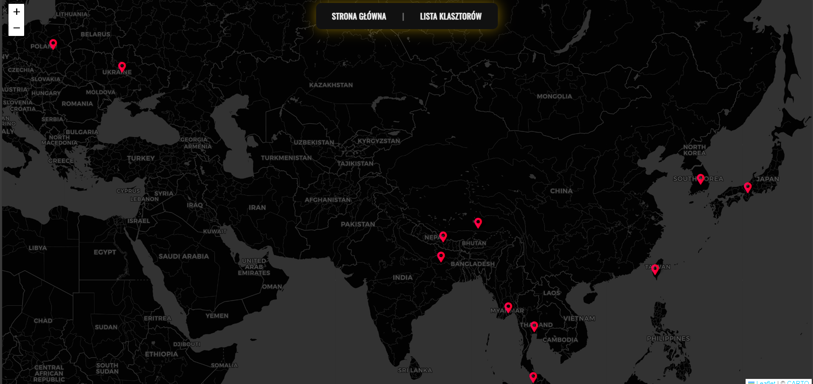
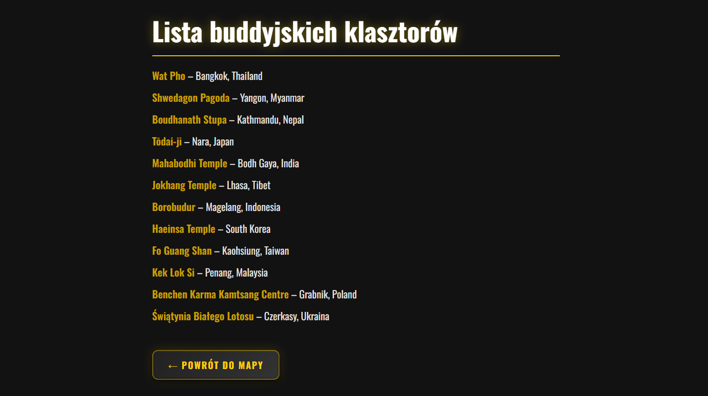
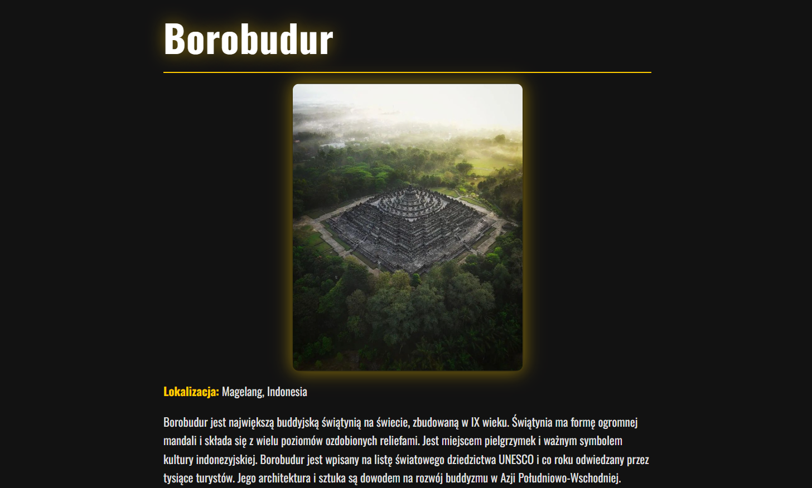

# Buddhist Monasteries Scraper & Web App

## 1. Wstęp

### Cel projektu  
Celem projektu jest stworzenie aplikacji, która pobiera, selekcjonuje i przechowuje dane o określonym profilu z różnych stron internetowych. Projekt demonstruje umiejętności wykorzystania wielowątkowości i wieloprocesowości z użyciem bibliotek `multiprocessing` i `asyncio`, implementacji parsowania danych za pomocą `BeautifulSoup` oraz zapisu danych w bazie MongoDB. Aplikacja posiada graficzny interfejs użytkownika zrealizowany w Pythonie (Flask), a całość jest rozproszona na trzy kontenery: interfejs, silnik oraz baza danych.

### Opis zakresu  
Projekt obejmuje:  
- pobieranie danych o buddyjskich klasztorach,  
- przetwarzanie danych w trybie wieloprocesowym,  
- zapis danych w MongoDB,  
- udostępnienie danych przez interfejs webowy,  
- rozproszenie aplikacji na moduły kontenerowe.

  

---

## 2. Analiza wymagań

- Profil danych: nazwa klasztoru, lokalizacja, opis, zdjęcia, strona internetowa  
- Obsługa wielu procesów i asynchroniczne przetwarzanie danych  
- Przechowywanie danych w bazie MongoDB  
- Graficzny interfejs użytkownika (webowy)

---

## 3. Implementacja

Dane pobierane są ze stron internetowych i parsowane przy użyciu biblioteki BeautifulSoup. Do asynchronicznego pobierania wykorzystano aiohttp, co pozwala na szybkie i efektywne pobieranie zawartości wielu stron. Przetwarzanie danych odbywa się w trybie wieloprocesowym przy pomocy modułu multiprocessing, co przyspiesza cały proces. Dane o klasztorach, takie jak nazwa, lokalizacja, opis oraz adres strony, są zapisywane w bazie MongoDB, z możliwością aktualizacji istniejących wpisów.

---

## 4. Baza danych

Dokumenty w bazie MongoDB zawierają szczegóły klasztorów, takie jak:  
- nazwa  
- lokalizacja  
- współrzędne GPS  
- adres strony internetowej  
- zdjęcia  
- opis

Struktura danych umożliwia łatwy dostęp i filtrowanie informacji w aplikacji webowej.

---

## 5. Interfejs użytkownika

Aplikacja webowa oferuje intuicyjny interfejs, w którym użytkownik może przeglądać buddyjskie świątynie na mapie z oznaczonymi markerami. Po kliknięciu na marker pojawiają się szczegółowe informacje o klasztorze: nazwa, opis oraz link do oficjalnej strony. Dodatkowo dostępna jest lista wszystkich świątyń, pozwalająca na szybkie wyszukiwanie i przejście do szczegółowego widoku konkretnego klasztoru.

---

## 6. Rozproszenie i wdrożenie

Projekt został podzielony na trzy niezależne kontenery Docker:  
- baza danych MongoDB (oficjalny obraz)  
- scraper odpowiedzialny za pobieranie i przetwarzanie danych  
- backend Flask udostępniający interfejs użytkownika  

Całość uruchamiana jest przy pomocy docker-compose, co pozwala łatwo zarządzać kontenerami, skalować aplikację oraz przenosić ją między środowiskami i serwerami.  

Polecenie do uruchomienia:  
`docker-compose up --build`

---

## 7. Podsumowanie

Projekt demonstruje nowoczesne podejście do pobierania i przetwarzania danych z internetu, wykorzystując asynchroniczność i wieloprocesowość, a także nowoczesne technologie bazodanowe i konteneryzację. Pozwala na wygodny dostęp do zgromadzonych informacji o buddyjskich klasztorach przez przejrzysty i funkcjonalny interfejs webowy.

---

